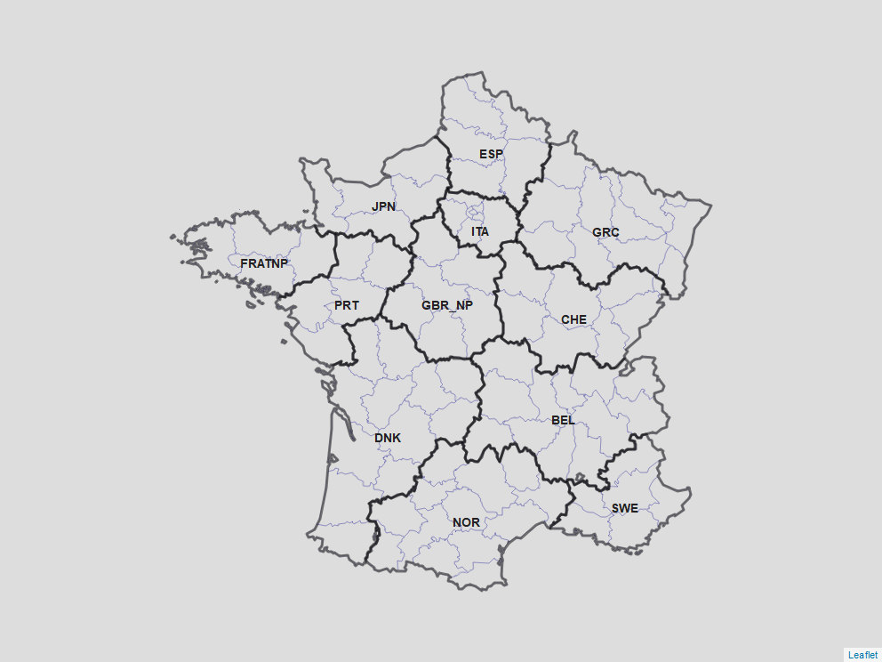

class: inverse, center, middle

```{r setup, include=FALSE}
knitr::opts_chunk$set(fig.retina = 3, fig.width = 6, fig.asp = 0.618, out.width = "70%", fig.align = "center", warning = FALSE, message = FALSE, echo = FALSE)

packages <- c("tidyverse", "ggplot2", "HMDHFDplus", "viridis", "scales",
              "forecast", "cowplot", "RColorBrewer", "raster", "spdep",
              "broom", "leaflet")
invisible( lapply(packages, library, character.only = TRUE))

```

# Comparison of small-area mortality estimation models

## A simulation setup

.large[Benjamin Schlüter]

<br/>

.large[BSPS 2022 | 5 Sep 2022]

<br/>
<br/>

```{r out.width = '30%'}
# logo needs to be both in wd and where .Rmd is located

```


---

# Context

Why do we need accurate mortality estimates by age and subnational areas?

* Document health inequalities

* Guide resource allocation

* Evaluate local policy measures

* Target areas most in need

<br/>

--

.center[`r fontawesome::fa("exclamation")`  .highlight[Small population = unreliable mortality measurements]  `r fontawesome::fa("exclamation")`]

???

* Stochasticity in death counts

* Slide 2->3: "Several models have been proposed to overcome this difficulty and estimate mortality age schedule at small-scale"


---

# Small-area estimation models 

.highlight[Hierarchical model]: leverage similarities in the data

.highlight[Models without area-level covariates]: endogeneity bias

--

```{r tab_models}
library(tidyverse)

models <- c("Congdon (2009)", "Schmertmann & Gonzaga (2016, 2018)", "Alexander et al. (2017)")
dims <- c("Age, Sex, Area", "Age, Sex, Area", "Age, Area, Time")
demo_comp <- c("Correlation over ages and sex", "Standard mortality age schedule", "Singular value decomposition")
spat_comp <- c("ICAR", "Hierarchy", "Hierarchy")
temp_comp <- c("No", "No", "Yes")

tab_models <- tibble("Model" = models,
                     "Dimensions" = dims,
                     "Demographic regularity" = demo_comp,
                     "Spatial component" = spat_comp
                     )
tab_models %>% 
   knitr::kable(format = "html") 
# %>% 
#           row_spec(0, background = "lightblue")

```

<br/>

--

`r fontawesome::fa("arrow-right")` Bayesian models


???

* Use the data from the totality of areas to provide more reliable
estimates in each of the constituent areas. Leverage correlation in mortality between neighboring areas.

* B-splines (Eilers & Marx) and D-splines (Schmertmann) not indirect estimation

* Bayesian modeling: natural framework for __hierachical__/ __indirect__ modeling


---
class: inverse, center, middle

# Resarch questions:

.left[
## 1. Which of these 3 models performs best ?

## 2. How is the performance affected by population size, spatial correlation and disparity in mortality ?
] 

<br/>

--

## .red[... cross-validation is  less intuitive in space]


???

* In comparison to time that is unidimensional (models for excess mortality during COVID19)

* Leave-one-out cross-validation

* AIC, WAIC: out-of-sample comparison but we have all data. We care about in-"sample" accuracy


---

# Methodology

.highlight[Simulation of a fictious country]

`r fontawesome::fa("arrow-right")` Mortality age schedules of departments within regions by gender

--

### Comparison metrics

.leftcol70[
* RMSE = $\sqrt{\frac{1}{G}\sum^G_{x=1}(\hat{m}_x - m^\star_x)^2}$
* Coverage = $\frac{1}{G}\sum^G_{x=1}1[m_x^\star \geq l_x]1[m_x^\star < r_x]$
]

.rightcol30[
$m_x^{\star}$ known (simulated)
]

--

### Different scenarii

* Population sizes

* Spatial correlation

* Disparity in mortality


???

* accuracy

* precision


---

# Methodology

### Simulation's requirements

* Coherent mortality age schedule (Nike shape)

* Realistic range of life expectancy at birth within the country 

* Mortality decreases over time

* Temporal stability of the best/worst performing departments

* At least two administrative levels 


???

* Previous work in France and Germany showed that $\Delta e^0 \leq 5-6$


---
class: inverse, center, middle

# Simulation setup


---

# Regional mortality standards

```{r map_hmd_ctry, fig.asp = 1, out.width = "80%"}
fr_reg <- readRDS("../../data/slides/fr_reg.rda")
fr_dpmt <- readRDS("../../data/slides/fr_dpmt.rda")


fr_reg@data$long <- coordinates(fr_reg)[,1] 
fr_reg@data$lat <- coordinates(fr_reg)[,2] - 0.5

m1 <- leaflet(fr_reg,
              options = leafletOptions(zoomControl = FALSE)) %>%
        addPolylines(data = fr_dpmt,
                     weight = 1,
                     opacity = 0.2,
                     color = "darkblue") %>%
        addLabelOnlyMarkers(lng = ~ long,
                            lat = ~ lat,
                            label =  ~ hmd_ctry,
                            labelOptions = labelOptions(noHide = T, 
                                                      direction = 'top',
                                                      textOnly = T,
                                                      style = list("font-size" = "14px",
                                                                   "font-weight" = "700")))
m1 <- addPolylines(m1, data = fr_reg, weight = 3, color = "black") 

# Workaround to make html-widget static
# In future, might be better to use an alternative to 
# leaflet

# htmlwidgets::saveWidget(m1, "./figure/simulation/leaflet_map.html", selfcontained = FALSE)
# webshot::webshot("./figure/simulation/leaflet_map.html", file = "./figure/simulation/leaflet_map.png",
#         cliprect = "viewport")



```

.center[Regional mortality =  HMD country mortality in 2003]


???

* Only use France __spatial structure__

* 12 regions = 12 HMD country in 2003

* Countries selected such that range(e0)<5y

* Slide 8->9 "But what we care about is departmental mortality not regional (admin 2)"


---

# Mortality at the level of departments

.highlight[Brass relational model]

.leftcol70[
$logit(l_x^{depmt}) = a + b \cdot logit(l^{regional~std}_x)$
]

.rightcol30[
.small[
$regional ~std \equiv HMD~country$ <br/> $by~sex$
]
]

--

```{r dev_brass}
radix <- 100000
logit_bel <- read.table(paste0("../../data/simulation/BEL_lt_m_5x1.txt"),
                                      header=T) %>%
                        mutate(Age = ifelse(Age == "110+", 110,
                                            sub("\\-.*", "", Age)),
                               Age = as.numeric(Age),
                               lx = as.numeric(lx)) %>% 
                        filter(Year == 2003,
                               Age> 0,
                               Age<= 100) %>% 
        # Construct logit from lx
                        mutate(lx = lx/radix,
                               yx = 0.5*log((1-lx)/lx),
                               # Replace Inf values if lx equal 0 
                               yx = ifelse(is.infinite(yx),
                                           0.5*log((1-1e-5)/1e-5),
                                           yx),
                               # Create deviation from std
                               "a=0.2, b=1" = 0.2 + yx,
                               "a=0, b=1.15" = 1.15 * yx,
                               "a=-0.4, b=0.8" = -0.4 + 0.8 * yx) %>% 
                                # Easier to perform math on all cases
                        pivot_longer("yx":"a=-0.4, b=0.8", names_to = "pars", values_to = "logit")
        

# Join to avoid looping
        df.lx <- expand.grid(age = c(0, 1, seq(5, 100, 5)),
                               pars = c("yx", "a=0.2, b=1", "a=0, b=1.15", "a=-0.4, b=0.8"))
        df.lx <- df.lx %>% 
                left_join(logit_bel %>%  
                                  rename("age" = Age) %>% 
                                  dplyr::select(age, logit, pars),
                          by = c("age", "pars")) %>% 
                mutate(lx = 1/(1 + exp(2*logit)),
                       # Set radix
                       lx = ifelse(age == 0, 1, lx),
                       pars = ifelse(pars == "yx", "Reg. std", pars),
                       # for line thickness in ggplot
                       bold = ifelse(pars == "Reg. std", "yes", "no"))
                        
ggplot(df.lx, aes(x = age, y = lx, group = pars, col = pars)) +
        geom_line(aes(size = bold)) +
        theme_bw() +
  theme(legend.position = c(0.2, 0.3)) +
        scale_size_manual(values = c(0.5, 1.4)) +
        labs(col = "Brass parameters") +
        guides(size = "none") +
  scale_color_viridis_d(option = "C", begin = 0.1, end = 0.8) +
  labs(y = expression(l[x]),
       x = "Age")
```

--

Random draws of a and b for each department?


???

* a: level of mortality

* b: relationship between young and old mortality

* Each department within the same region has the same standard (HMD country)


---

# Correlation between Brass parameters

```{r corr_brass_pars, out.width = "65%"}
df.brass.pars <- readRDS("../../data/simulation/brass_pars_t.rda")
ctries.shown <- c("BEL", "FRATNP", "NOR", "GBR_NP")
# Plots Brass pars
df.brass.pars %>% 
  filter(country %in% ctries.shown) %>% 
  ggplot(aes(x = a, y = b)) +
        geom_point(aes(col = year)) +
        theme_bw() +
        theme() +
        labs(col = "Year",
             title = "Temporal evolution of a and b, 2004-2017",
             subtitle = "lx of 2003 used as standards") +
        scale_color_viridis_c(option = "C") +
        facet_wrap(country ~ sex,
                   ncol = 4,
                   scales = "free_y") +
        labs(x = "a",
             y = "b")

```

--

.highlight[Multivariate random walks with drift]

* Drifts and covariance matrices estimated on HMD data between 2004-2017

--

   * Drift `r fontawesome::fa("arrow-right")` Temporal improvement (differs by region)

   * Scaling covariance matrices `r fontawesome::fa("arrow-right")` Disparity/stability over time


???

* Correlation between a and b for a given sex

* Correlation between a(b) and a(b) for different sex

* Correlation between a and b for different sex

* ! Use covariance matrices estimated over time to generate a and b over space !

* Rescaling of covariance matrices (make variances of a and b smaller)


---
class: inverse, center, middle

# Simulation outputs


---

# Simulated vs estimated a and b

```{r gen_brass_pars, out.width = "90%"}
df.areas.pars.sim <- readRDS("../../data/simulation/brass_pars_sim.rda")

ctries.shown <- c("BEL", "GBR_NP")

ggplot() +
        facet_wrap(country ~ par,
                   ncol = 2,
                   scales = "free_y") +
        geom_line(data = df.brass.pars %>% 
                          filter(year <= 2013,
                                 country %in% ctries.shown) %>% 
                          pivot_longer(a:b, names_to = "par"),
                  aes(x = year, y = value, col = sex, size = "Estimated (HMD)")) +
        geom_line(data = df.areas.pars.sim %>% 
                          rename("country" = reg) %>% 
                          filter(country %in% ctries.shown) %>% 
                          mutate(year = as.numeric(year) + 2003,
                                 grouping = paste(unit, sex, sep="-")) %>% 
                          pivot_longer(a:b, names_to = "par"),
                  aes(x = year, y = value, col = sex, group = grouping,
                      size = "Simulated"),
                  alpha = .7) +
        scale_color_viridis_d(option = "E", begin = 0.1, end = 0.8) +
        scale_size_manual(name = "Brass pars",
                          values = c("Estimated (HMD)" = 1.5, "Simulated" = 0.5)) +
        theme_bw() +
        labs(y = "Value",
             x = "Year",
             col = "Gender")

```

.center[
$a_t = a_{t-1} + \hat{drift} + e_t$
]


???

* Brief and intuitive explanation of generation of random walk with drift

* Less up and down in generated than estimated pars due to scaling of covariance matrices


---

# Simulated mortality age schedules

```{r gen_mx, out.width = "100%"}

df.areas.lx.sim <- readRDS("../../data/simulation/df_hmd_fr.rda")

df.areas.lx.sim %>% 
        filter(area %in% sample(1:94, 3)) %>% 
        mutate(year = as.numeric(year),
               area = paste0("Department ", area)) %>% 
        ggplot(aes(x = age, y = nmx, col = year, group = year)) +
        facet_wrap(area ~ sex, ncol = 2) +
        geom_line() +
        theme_bw() +
        scale_y_log10() +
        labs(y = expression(m[x]*" (log scale)"),
             x = "Age",
             col = "Year")
```


---

# Simulated life expectancy at birth

```{r e0_gen, out.width = "100%"}

df.areas.lx.sim %>% 
        filter(age == 0) %>%
        ggplot(aes(x = year, y = ex)) +
        facet_wrap(~ sex,
                   scales = "free_y") +
        geom_jitter(aes(col = reg),
                    width = 0.2) +
        theme_bw() +
        theme(legend.title = element_blank()) +
        scale_color_viridis_d(option = "C") +
  labs(y = expression(e^0),
       x = "Year")

```


???

* Temporal stability of the best/worst performing areas

* Realistic mortality decreases over time

* Realistic disparity in $e^0$


---

# Ranking of departments

```{r rank_dpmt, out.width = "100%"}

# e0 ranking evolution over time
# Female
areas.ord <- df.areas.lx.sim %>% 
        filter(year == 1,
               age == 0, 
               sex == "f") %>% 
        arrange(desc(ex)) %>% 
        pull(area)
# by area
fig1 <- df.areas.lx.sim %>% 
        filter(age == 0,
               sex == "f") %>% 
        group_by(year) %>% 
        arrange(desc(ex),
                .by_group = TRUE) %>% 
        mutate(rank = 1:94) %>% 
        ungroup() %>% 
        mutate(area = factor(area,
                             levels = areas.ord,
                             labels = areas.ord)) %>% 
        ggplot(aes(x = year, y = rank, col = area, group = area)) +
        geom_line(size = 1) +
        geom_point(shape = 1) +
        theme_bw() +
        theme(legend.position = "none") +
        scale_y_continuous(limits = c(1, 94), breaks = c(1, seq(5, 90, 5), 94)) +
        scale_color_viridis_d() +
        labs(y = expression("Rank(" * e^0 * ")"),
             x = "Year")
# Male
areas.ord <- df.areas.lx.sim %>% 
        filter(year == 1,
               age == 0, 
               sex == "m") %>% 
        arrange(desc(ex)) %>% 
        pull(area)
# by area
fig2 <- df.areas.lx.sim %>% 
        filter(age == 0,
               sex == "m") %>% 
        group_by(year) %>% 
        arrange(desc(ex),
                .by_group = TRUE) %>% 
        mutate(rank = 1:94) %>% 
        ungroup() %>% 
        mutate(area = factor(area,
                             levels = areas.ord,
                             labels = areas.ord)) %>% 
        ggplot(aes(x = year, y = rank, col = area, group = area)) +
        geom_line(size = 1) +
        geom_point(shape = 1) +
        theme_bw() +
        theme(legend.position = "none") +
        scale_y_continuous(limits = c(1, 94), breaks = c(1, seq(5, 90, 5), 94)) +
        scale_color_viridis_d() +
        labs(y = expression("Rank(" * e^0 * ")"),
             x = "Year")

plot_grid(fig1, fig2, labels = c("f", "m"))
```


???

One color = one department: colors do not mixed completely: temporal stability in health performance.


---

# Scenarii creation

* Clustering `r fontawesome::fa("arrow-right")` random spatial correlation 

   * Randomly reshuffle the generated mortality age schedules to departments
   
<br/>

* Different population sizes

   * $D_x \sim Poisson(m_x^{Sim}E_x)$ `r fontawesome::fa("arrow-right")` $\Delta E_x$ 
   
<br/>

* Change disparity in mortality

   * Modify set of HMD countries


???

* Spatial correlation created (Moran's I stat.)


---

# Next steps

* Define different scenarii

* Run models on simulation 

* Compute comparison metrics

* Development of a new model

# Limitations

* Temporal covariance for spatial covariance

* Importance of region

* Reinforce similarity within region


---
class: inverse, center, middle

# Thank you for your attention !

<br/>
<br/>

.left[
`r fontawesome::fa("at")` .link-email[[benjamin-samuel.schluter@uclouvain.be](benjamin-samuel.schluter@uclouvain.be)]

`r fontawesome::fa("slideshare")` .link-email[[http://benjisamschlu.github.io/BSPS2022-models-comparison/slides.html](http://benjisamschlu.github.io/BSPS2022-models-comparison/slides.html)]

`r fontawesome::fa("github")` .link-email[[@benjisamschlu](https://github.com/benjisamschlu)]
]